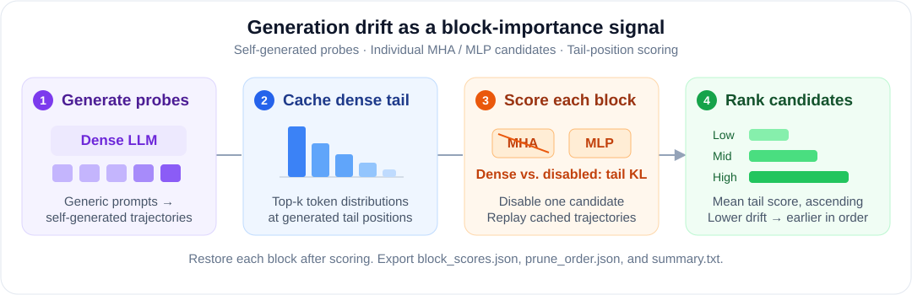

<div align="center">

# GDPruner

### Generation-Drift-Guided Block Pruning for Large Language Models

**Identify redundant Transformer blocks through their impact on generation.**

<p>
  <a href="https://www.python.org/"></a>
  <a href="https://pytorch.org/"></a>
  <a href="https://huggingface.co/docs/transformers"></a>
</p>

[Overview](#overview) &nbsp; | &nbsp; [Quick start](#quick-start) &nbsp; | &nbsp; [Configuration](#configuration) &nbsp; | &nbsp; [Outputs](#outputs)

</div>

<p align="center">
  
</p>

<p align="center"><em>Core scoring pipeline. Lower generation drift places a block earlier in the candidate pruning order.</em></p>

## Overview

GDPruner uses generation drift to estimate the importance of individual multi-head attention (MHA) and multi-layer perceptron (MLP) blocks. The dense model generates its own probe trajectories; candidate blocks are then scored against the dense model's output distributions at the tail of those trajectories.

This repository provides a **minimal demonstration of the core scoring pipeline**. It produces block scores and a candidate pruning order for use in a pruning workflow. Each block is temporarily disabled on its own and restored after scoring; this demo does not export a structurally pruned model or run the full adaptive search and benchmark evaluation.

| Step | What the demo does |
| --- | --- |
| **1. Generate probes** | Create short continuations from built-in generic prompts using the dense model. |
| **2. Cache dense outputs** | Store the dense model's top-k token distributions at tail positions. |
| **3. Score candidates** | Disable one MHA or MLP block, replay the cached trajectory, and compute a top-k approximation to dense-to-disabled tail KL divergence. |
| **4. Rank blocks** | Sort candidates by their mean tail score, from lower to higher generation drift. |

## Quick start

### 1. Clone the repository

```bash
git clone https://github.com/jikiii/GDPruner.git
cd GDPruner
```

### 2. Install the dependencies

Use a Python environment with PyTorch, Transformers, Accelerate, and tqdm installed:

```bash
python -m pip install torch transformers accelerate tqdm
```

Install a PyTorch build appropriate for your hardware. The default configuration loads the full **Qwen2.5-7B-Instruct** model in FP16 with automatic device placement, so available memory must accommodate the model and its forward passes. Model weights and the tokenizer are downloaded on the first run unless a local model path is supplied.

### 3. Run the scoring demo

```bash
python gdpruner.py
```

The default run uses **8 prompts**, generates up to **64 continuation tokens** per prompt, scores the last **16 generated positions**, and scans the first **24 candidate blocks**. Generic prompts are included in the script; no external calibration dataset is required.

For a shorter scan with the same model:

```bash
python gdpruner.py --num_prompts 4 --max_blocks 8
```

To scan all discovered MHA and MLP blocks:

```bash
python gdpruner.py --max_blocks -1
```

To use a local model and a separate output directory:

```bash
python gdpruner.py --model_name_or_path /path/to/model --output_dir ./outputs/local-model
```

## Configuration

| Argument | Default | Purpose |
| --- | --- | --- |
| `--model_name_or_path` | `Qwen/Qwen2.5-7B-Instruct` | Hugging Face model ID or local model directory. |
| `--output_dir` | `./outputs` | Directory for the score files and summary. |
| `--num_prompts` | `8` | Number of built-in prompts to use; 10 prompts are available. |
| `--gen_len` | `64` | Maximum number of continuation tokens per prompt. |
| `--tail_len` | `16` | Number of tail positions used for scoring, capped by the generated continuation length. |
| `--top_k` | `128` | Number of dense-model tokens retained per position for the KL approximation. |
| `--max_blocks` | `24` | Number of candidate blocks to scan; use `-1` for all blocks. |
| `--dtype` | `float16` | Model loading dtype: `auto`, `float16`, `bfloat16`, or `float32`. |
| `--device_map` | `auto` | Automatic device placement; `none` selects a single CUDA device or CPU. |
| `--do_sample` | Off | Enable sampled probe generation; greedy decoding is the default. |
| `--temperature` | `0.8` | Sampling temperature when `--do_sample` is enabled. |
| `--top_p` | `0.95` | Nucleus sampling threshold when `--do_sample` is enabled. |
| `--seed` | `42` | Random seed. |

The decoder-layer and block helpers in [`utils.py`](utils.py) use common Hugging Face architecture conventions. Other architectures may require adapting the layer lookup or disabled-attention return signature.

## Outputs

Results are written to `--output_dir`:

```text
outputs/
├── block_scores.json
├── prune_order.json
└── summary.txt
```

| File | Contents |
| --- | --- |
| `block_scores.json` | Sorted records containing the block name, layer index, block type, and `tail_kl` score. |
| `prune_order.json` | Candidate block names ordered from lower to higher tail score. |
| `summary.txt` | Run configuration and the ten lowest-drift candidate blocks, or fewer for a shorter scan. |

`tail_kl` is computed on the dense model's top-k token support and averaged over probe tail positions. It is an approximation to full-vocabulary KL divergence. Lower values indicate less drift under these probes, and the list is a scoring result rather than a jointly validated removal schedule.

## Repository structure

```text
GDPruner/
├── assets/
│   └── overview.svg    # Scoring pipeline diagram
├── gdpruner.py         # Probe generation, dense caching, scoring, and ranking
├── utils.py            # Block discovery and temporary block disabling
└── README.md
```
